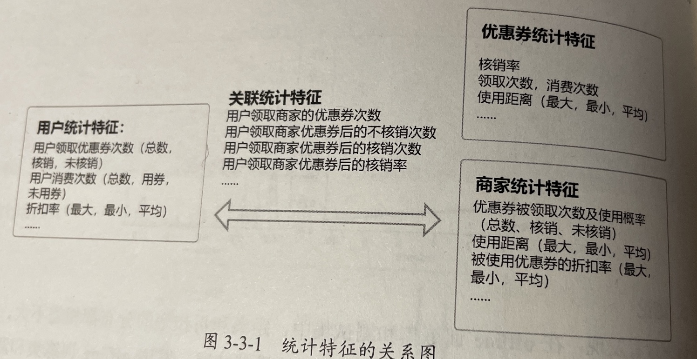

## 2 数据探索

在进行特征提取和模型开发之前，需要对数据的情况进行了解，要考虑的问题包括：

- 数据是如何产生的？
- 数据是原始数据，还是二次加工数据？
- 数据包括哪些业务背景，数据字段有什么含义？
- 数据字段是什么类型的？
- 每个字段的分布是怎样的？
- 训练集和测试集的数据分布是否有差异？
- 数据量是否充分，是否有外部数据进行补充？
- 数据本身是否有噪声，是否需要进行数据清洗和降维操作？
- 赛题的评价函数是什么及和数据字段有什么关系？
- 数据字段与赛题标签的关系？

### 2.1 理论知识

#### 2.1.1 数据探索的定义

数据探索是通过使用可视化的方式分析数据，提取数据的主要特性，包括数据量、完整性、正确性、可能的相互关系等。一般从数据质量和数据特征两方面进行数据探索分析。

- 数据探索
  - 数据质量
    1. 数据值分析
    2. 异常值分析
    3. 一致性分析
  - 数据特征
    1. 分布分析
    2. 对比分析
    3. 统计量分析
    4. 相关性分析

#### 2.1.2 数据探索的目的

得到数据的直觉、发觉潜在的结构、提取重要的变量、删除异常值，检验潜在的假设和建立初步的模型。

### 2.2 初步的数据探索

## 3 特征工程

### 3.1 特征工程思路

- **评估穿越**。在机器学习中，我们之所以划分训练集和测试集，主要就是希望在测试集上做评估，而不是在训练集上做评估，防止发生过拟合，进而使评估结果更加准确。评估穿越，指的就是由于样本划分不当，使测试集中的信息**穿越**到了训练集中，导致评估结果更偏爱过拟合的模型，致使结果不够准确。
- **滑窗**。滑动窗口就是指定单位长度的时间序列，然后计算窗口区间的统计指标。这一过程也相当于让一个指定长度的滑块在刻尺上滑动，每滑动一个单位即可反馈滑块内的数据。采用滑窗的方法可以得到多份训练数据集，特征的窗口区间越小，得到的训练数据集的数量越多。
- **穿越特征**。在预测集上提取的特征，或者外部取得的在目标时间段内的数据。
- **特征方案**。特征总体关系图

### 3.2 特征构建

特征工程代码主要分为工具函数、特征群生成函数、版本集成函数和特征生成函数，调用关系为特征生成函数->版本集成函数->特征群生成几乎是->工具函数。